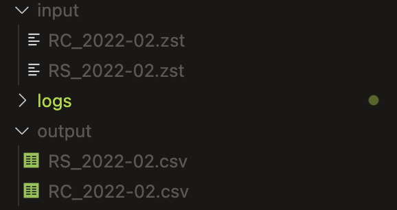
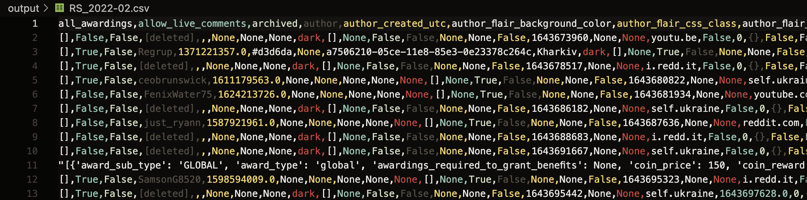

# Reddit Dump Extractor

This repository contains tools for filtering and extracting data from compressed Reddit dump files (.zst format).

## Available Tools

### 1. **reddit_zst_filter.py** - Full-Featured Python Processor
The main Python script for comprehensive data processing with in-memory filtering.

### 2. **shell_filter.py** - Memory-Efficient Shell-Based Processor
A lightweight alternative that uses shell commands (zstd + jq) for systems with limited computing resources. This tool streams data through Unix pipes, avoiding memory overload on large files.

## When to Use Each Tool

| Tool | Best For | Memory Usage | Speed |
|------|----------|--------------|-------|
| `reddit_zst_filter.py` | Full control, complex filtering, stable systems | High | Fast |
| `shell_filter.py` | Limited RAM, huge files, simple filters | Very Low | Moderate |

## Data

Files for your research can be downloaded [here](https://academictorrents.com/details/30dee5f0406da7a353aff6a8caa2d54fd01f2ca1)

## Installation

### macOS / Linux

```bash
python3 -m venv venv
source ./venv/bin/activate
pip install -r requirements.txt
```

**For shell_filter.py on macOS, also install:**
```bash
brew install zstd coreutils jq
```

**For shell_filter.py on Linux:**
```bash
sudo apt install zstd coreutils jq
```

### Windows

```bash
python -m venv venv
venv\Scripts\activate
pip install -r requirements.txt
```

**For shell_filter.py on Windows:**

The shell-based tool works best with WSL (Windows Subsystem for Linux):
```bash
# Install WSL first (PowerShell as Admin)
wsl --install

# Then inside WSL:
sudo apt update
sudo apt install zstd coreutils jq python3 python3-pip
pip3 install -r requirements.txt
```

You can also use the pyenv library to easily manage your Python environments.
Tutorial for macOS / Linux - https://github.com/pyenv/pyenv
Tutorial for Windows - https://github.com/pyenv-win/pyenv-win

## Usage

### Option 1: Full Python Script (reddit_zst_filter.py)

```bash
python reddit_zst_filter.py <input_folder> [options]
```

#### Options

| Option | Description | Default |
|--------|-------------|---------|
| `--output_dir` | Output directory for filtered files | `output` |
| `--format` | Output format: `parquet` or `csv` | `csv` |
| `--field` | Field to filter on | `subreddit` |
| `--value` | Comma-separated values to match | `ukraine` |
| `--regex` | Enable regex pattern matching | `False` |
| `--file_filter` | Regex pattern for input filenames | `^RC_\|^RS_` |
| `--config` | Path to config file | `config.json` |

### Option 2: Shell-Based Script (shell_filter.py)

**Use this when:**
- Your system has limited RAM (< 2GB available)
- Processing very large .zst files (> 2GB compressed)
- Getting out-of-memory errors with the main script
- You need simple field matching (subreddit, author, etc.)

```bash
python shell_filter.py <input_folder> [options]
```

#### Options

| Option | Description | Default |
|--------|-------------|---------|
| `--output_dir` | Output directory for filtered files | `output` |
| `--format` | Output format: `parquet` or `csv` | `csv` |
| `--field` | Field to filter on | `subreddit` |
| `--value` | Values to match (comma or pipe-separated) | `ukraine` |
| `--regex` | Enable regex pattern matching | `False` |
| `--file_filter` | Regex pattern for input filenames | `^RC_\|^RS_` |
| `--config` | Path to config file | `config.json` |
| `--chunk_size` | Lines per processing chunk | `1000000` |

**How it works:**
1. Uses multi-threaded `zstd` decompression for speed
2. Splits data into chunks using `gsplit` (GNU split)
3. Filters each chunk with `jq` (fast JSON processor)
4. Combines results into Parquet/CSV files
5. Automatically cleans up temporary files

### Available Fields

Reddit data contains the following fields that can be used for filtering:

- `author` - Author of the comment/post
- `body` - Text content of the comment
- `subreddit` - Name of the subreddit
- `created_utc` - Creation timestamp (UTC)
- `score` - Number of upvotes/downvotes
- `id` - Unique identifier
- `link_id` - ID of the linked post
- `parent_id` - ID of the parent comment
- `edited` - Edit timestamp
- `archived` - Archive status
- `gilded` - Number of awards received

## Examples

### Using reddit_zst_filter.py

**Filter by subreddit:**
```bash
python reddit_zst_filter.py /path/to/dumps --value python
```

**Multiple subreddits:**
```bash
python reddit_zst_filter.py /path/to/dumps --value "python,javascript,java"
```

**Output to Parquet format:**
```bash
python reddit_zst_filter.py /path/to/dumps --format parquet --output_dir parquet_output
```

**Filter by author:**
```bash
python reddit_zst_filter.py /path/to/dumps --field author --value "username"
```

**Regex matching:**
```bash
python reddit_zst_filter.py /path/to/dumps --value "^(python|java)" --regex
```

**Custom file filter (process only comments from 2023):**
```bash
python reddit_zst_filter.py /path/to/dumps --file_filter "^RC_2023-"
```

### Using shell_filter.py (Low Resource Systems)

**Filter by subreddit:**
```bash
python shell_filter.py /path/to/dumps --value ukraine
```

**Multiple subreddits (comma-separated):**
```bash
python shell_filter.py /path/to/dumps --value "ukraine,worldnews,europe"
```

**Multiple subreddits (pipe-separated, regex):**
```bash
python shell_filter.py /path/to/dumps --value "ukraine|worldnews|europe" --regex
```

**Filter comments by keywords in body text:**
```bash
python shell_filter.py /path/to/dumps --field body --value "kyiv,war" --regex
```

**Filter by author:**
```bash
python shell_filter.py /path/to/dumps --field author --value "username"
```

**Smaller chunks for very limited memory:**
```bash
python shell_filter.py /path/to/dumps --chunk_size 500000
```

**Output to Parquet format:**
```bash
python shell_filter.py /path/to/dumps --format parquet --output_dir parquet_output
```

**Process only submissions (posts) from 2021:**
```bash
python shell_filter.py /path/to/dumps --file_filter "^RS_2021-"
```

## Configuration

The tool uses a [config.json](config.json) file for advanced settings:

- **File Reading**: Chunk sizes and memory window settings for .zst decompression
- **Logging**: Log directory, file rotation, and format
- **Processing**: Progress reporting intervals
- **Output**: Compression settings for Parquet (snappy) and CSV (gzip/none)
- **Data Normalization**: Automatic type conversion for problematic boolean fields

## Output

Each input `.zst` file is processed individually and outputs a separate file:

- **Parquet**: `output/RC_2023-01.parquet`
- **CSV**: `output/RC_2023-01.csv` or `output/RC_2023-01.csv.gz` (if compression enabled)

The tool logs:
- Processing progress every 5M lines (reddit_zst_filter.py)
- Memory usage (RAM)
- CPU usage
- Total records matched per file
- Final statistics (total lines, matches, errors, processing rate)

### Directory Structure Example

The output files are organized in the output directory with preserved naming from the input files:



### CSV Output Example

The CSV output contains all filtered Reddit comments/posts with their metadata fields:



**Optimizations:**
- Streaming decompression
- Memory monitoring and reporting
- Fast JSON parsing with orjson
- Efficient field filtering (exact match or regex)
- Sequential file processing
- Configurable chunk sizes and buffer settings

### shell_filter.py
- **Memory**: Minimal - streams through Unix pipes
- **Speed**: Moderate (limited by pipe overhead)
- **Best for**: Systems with 4-8GB RAM, simple field matching

**Optimizations:**
- Multi-threaded zstd decompression (`-T0` flag)
- Streaming pipeline (no intermediate files until final output)
- Automatic temporary file cleanup
- Adjustable chunk sizes for memory control

## Troubleshooting

### Out of Memory Errors

If `reddit_zst_filter.py` runs out of memory:
1. Switch to `shell_filter.py`
2. Reduce `chunk_size` parameter: `--chunk_size 500000`
3. Process one file at a time instead of a directory
4. Close other applications to free up RAM

### Command Not Found Errors (shell_filter.py)

**macOS:**
```bash
# Install missing tools
brew install zstd coreutils jq
```

**Linux:**
```bash
sudo apt install zstd coreutils jq
```

**Windows:**
Use WSL (see Installation section above)

## Requirements

### For reddit_zst_filter.py
- Python 3.13
- pandas
- pyarrow
- zstandard
- orjson
- psutil

### For shell_filter.py
- Python 3.13
- pandas
- pyarrow
- psutil
- **System tools**: zstd, coreutils (gsplit), jq

See [requirements.txt](requirements.txt) for complete Python dependencies.

## Credits

This project is based on code and approaches from:
- **[Watchful1](https://github.com/Watchful1)** - Original author of [PushshiftDumps](https://github.com/Watchful1/PushshiftDumps/tree/master/scripts) scripts that served as the foundation for this tool
- **Pushshift Team** - For collecting, archiving, and making available the comprehensive Reddit dataset

### Updated Version
This enhanced and adapted version was prepared as part of the **Computational Social Science (CSS) course, 2025, NaUKMA**.

## Acknowledgments

Special thanks to:
- [Watchful1](https://github.com/Watchful1) for creating the original filtering and processing logic
- The Pushshift project for their invaluable work in archiving and providing access to Reddit data
- All contributors to the open-source tools and libraries that make this project possible